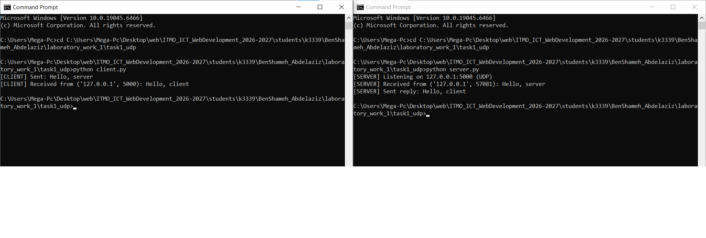
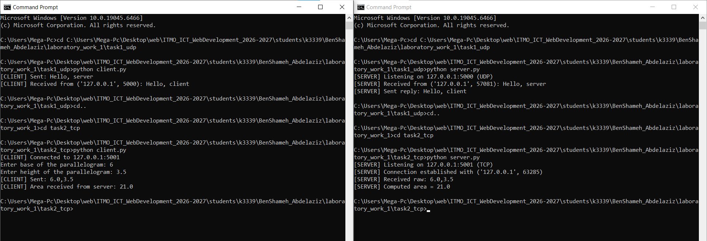
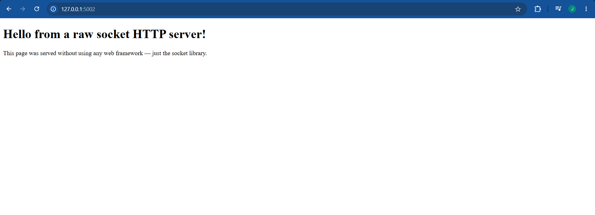
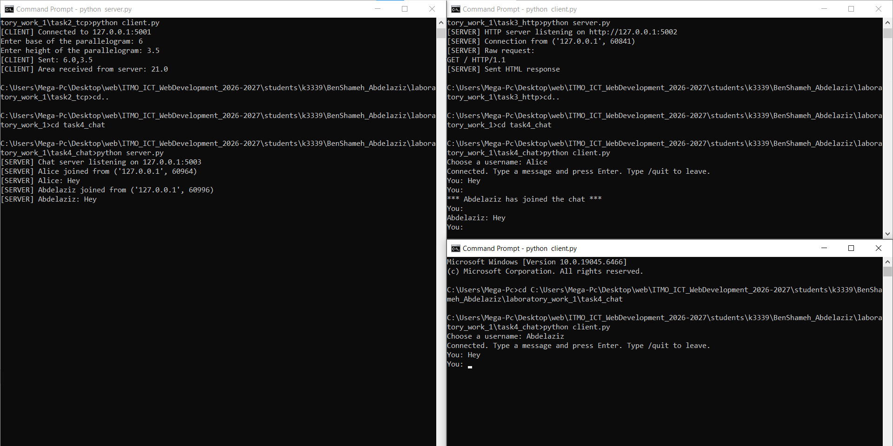
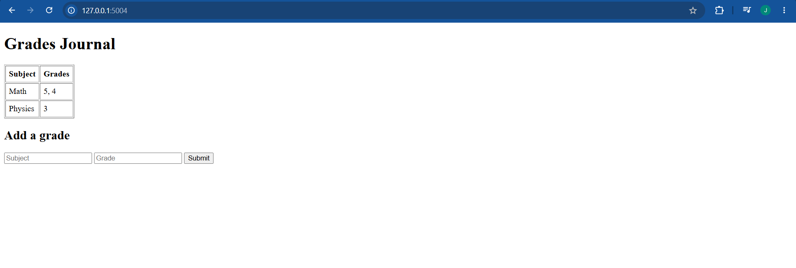

# ЛР1 — Работа с сокетами

## Практическое задание 1. Обмен сообщениями по UDP

**Протокол:** UDP (`socket.SOCK_DGRAM`) — протокол без установления соединения. Клиент отправляет датаграмму методом `sendto()`, указывая адрес получателя при каждой отправке. Сервер принимает данные методом `recvfrom()`, который также возвращает адрес отправителя, необходимый для ответа.

### Сервер (`server.py`)

```python
import socket

HOST = "127.0.0.1"
PORT = 5000

def main():
    server_socket = socket.socket(socket.AF_INET, socket.SOCK_DGRAM)
    server_socket.bind((HOST, PORT))
    print(f"[SERVER] Listening on {HOST}:{PORT} (UDP)")

    data, client_address = server_socket.recvfrom(1024)
    message = data.decode()
    print(f"[SERVER] Received from {client_address}: {message}")

    reply = "Hello, client"
    server_socket.sendto(reply.encode(), client_address)
    print(f"[SERVER] Sent reply: {reply}")

    server_socket.close()

if __name__ == "__main__":
    main()
```

### Клиент (`client.py`)

```python
import socket

SERVER_HOST = "127.0.0.1"
SERVER_PORT = 5000

def main():
    client_socket = socket.socket(socket.AF_INET, socket.SOCK_DGRAM)

    message = "Hello, server"
    client_socket.sendto(message.encode(), (SERVER_HOST, SERVER_PORT))
    print(f"[CLIENT] Sent: {message}")

    data, server_address = client_socket.recvfrom(1024)
    print(f"[CLIENT] Received from {server_address}: {data.decode()}")

    client_socket.close()

if __name__ == "__main__":
    main()
```

### Пример работы в терминале

```
[SERVER] Listening on 127.0.0.1:5000 (UDP)
[SERVER] Received from ('127.0.0.1', 58717): Hello, server
[SERVER] Sent reply: Hello, client
```

```
[CLIENT] Sent: Hello, server
[CLIENT] Received from ('127.0.0.1', 5000): Hello, client
```



---

## Практическое задание 2. Вычисления через TCP (Вариант 4 — площадь параллелограмма)

**Протокол:** TCP (`socket.SOCK_STREAM`) — протокол с установлением соединения. Перед обменом данными клиент выполняет `connect()`, а сервер — `accept()`, после чего гарантируется доставка и порядок байт.

**Формула:** площадь параллелограмма = основание × высота.

### Сервер (`server.py`)

```python
import socket

HOST = "127.0.0.1"
PORT = 5001

def compute_parallelogram_area(base: float, height: float) -> float:
    return base * height

def main():
    server_socket = socket.socket(socket.AF_INET, socket.SOCK_STREAM)
    server_socket.setsockopt(socket.SOL_SOCKET, socket.SO_REUSEADDR, 1)
    server_socket.bind((HOST, PORT))
    server_socket.listen(1)
    print(f"[SERVER] Listening on {HOST}:{PORT} (TCP)")

    conn, addr = server_socket.accept()
    print(f"[SERVER] Connection established with {addr}")

    with conn:
        data = conn.recv(1024).decode()
        base_str, height_str = data.split(",")
        base, height = float(base_str), float(height_str)

        area = compute_parallelogram_area(base, height)
        print(f"[SERVER] Computed area = {area}")
        conn.sendall(str(area).encode())

    server_socket.close()

if __name__ == "__main__":
    main()
```

### Клиент (`client.py`)

```python
import socket

SERVER_HOST = "127.0.0.1"
SERVER_PORT = 5001

def main():
    client_socket = socket.socket(socket.AF_INET, socket.SOCK_STREAM)
    client_socket.connect((SERVER_HOST, SERVER_PORT))

    base = float(input("Enter base of the parallelogram: "))
    height = float(input("Enter height of the parallelogram: "))

    message = f"{base},{height}"
    client_socket.sendall(message.encode())

    data = client_socket.recv(1024).decode()
    print(f"[CLIENT] Area received from server: {data}")

    client_socket.close()

if __name__ == "__main__":
    main()
```

### Пример работы в терминале

Ввод: основание = 6, высота = 3.5

```
[SERVER] Listening on 127.0.0.1:5001 (TCP)
[SERVER] Connection established with ('127.0.0.1', 44488)
[SERVER] Received raw: 6.0,3.5
[SERVER] Computed area = 21.0
```

```
[CLIENT] Connected to 127.0.0.1:5001
Enter base of the parallelogram: 6
Enter height of the parallelogram: 3.5
[CLIENT] Area received from server: 21.0
```



---

## Практическое задание 3. Раздача HTML-страницы по HTTP

**Протокол:** HTTP поверх TCP. HTTP-ответ — это обычный текст в строгом формате: строка статуса, заголовки, пустая строка и тело. Сервер читает `index.html`, вычисляет `Content-Length` и отправляет один пакет через тот же сокет, что принял подключение.

### Сервер (`server.py`)

```python
import socket
import os

HOST = "127.0.0.1"
PORT = 5002
HTML_FILE = os.path.join(os.path.dirname(__file__), "index.html")

def build_http_response(body: str) -> bytes:
    body_bytes = body.encode("utf-8")
    headers = (
        "HTTP/1.1 200 OK\r\n"
        "Content-Type: text/html; charset=utf-8\r\n"
        f"Content-Length: {len(body_bytes)}\r\n"
        "Connection: close\r\n"
        "\r\n"
    )
    return headers.encode("utf-8") + body_bytes

def main():
    server_socket = socket.socket(socket.AF_INET, socket.SOCK_STREAM)
    server_socket.setsockopt(socket.SOL_SOCKET, socket.SO_REUSEADDR, 1)
    server_socket.bind((HOST, PORT))
    server_socket.listen(1)
    print(f"[SERVER] HTTP server listening on http://{HOST}:{PORT}")

    with open(HTML_FILE, "r", encoding="utf-8") as f:
        html_content = f.read()

    conn, addr = server_socket.accept()
    with conn:
        request = conn.recv(4096).decode(errors="ignore")
        response = build_http_response(html_content)
        conn.sendall(response)

    server_socket.close()

if __name__ == "__main__":
    main()
```

### Пример работы (запрос через curl / браузер)

```
$ curl http://127.0.0.1:5002/
<!DOCTYPE html>
<html lang="en">
<head>
    <meta charset="UTF-8">
    <title>Sockets Lab</title>
</head>
<body>
    <h1>Hello from a raw socket HTTP server!</h1>
    <p>This page was served without using any web framework — just the socket library.</p>
</body>
</html>
```



---

## Практическое задание 4. Многопользовательский чат (TCP + threading)

**Реализация:** многопользовательский чат по протоколу TCP с использованием библиотеки `threading` — на **100% баллов**.

**Архитектура:** сервер хранит словарь `{username: socket}` активных клиентов, защищённый `threading.Lock`. Для каждого подключившегося клиента запускается отдельный поток (`handle_client`), который блокируется на `conn.recv()` независимо от остальных — это позволяет серверу обслуживать нескольких пользователей одновременно. При получении сообщения от одного клиента сервер рассылает его всем остальным (`broadcast`). Клиент выходит из чата командой `/quit`.

На стороне клиента также используется поток: один поток слушает входящие сообщения (`listen_for_messages`), а главный поток обрабатывает ввод пользователя — иначе клиент не смог бы одновременно печатать и получать сообщения.

Клиент реализован **одним файлом** `client.py`; несколько пользователей независимо запускают его в разных терминалах — личность пользователя не жёстко закодирована в файле, а вводится при запуске (`input("Choose a username: ")`).

### Сервер (`server.py`)

```python
import socket
import threading

HOST = "127.0.0.1"
PORT = 5003

clients = {}
clients_lock = threading.Lock()

def broadcast(message: str, exclude_username: str = None):
    with clients_lock:
        for username, conn in list(clients.items()):
            if username == exclude_username:
                continue
            try:
                conn.sendall(message.encode())
            except OSError:
                pass

def handle_client(conn: socket.socket, addr):
    username = None
    try:
        username = conn.recv(1024).decode().strip()
        with clients_lock:
            clients[username] = conn
        broadcast(f"*** {username} has joined the chat ***", exclude_username=username)

        while True:
            data = conn.recv(1024)
            if not data:
                break
            text = data.decode().strip()
            if text == "/quit":
                break
            broadcast(f"{username}: {text}", exclude_username=username)

    except (ConnectionResetError, OSError):
        pass
    finally:
        if username:
            with clients_lock:
                clients.pop(username, None)
            broadcast(f"*** {username} has left the chat ***", exclude_username=username)
        conn.close()

def main():
    server_socket = socket.socket(socket.AF_INET, socket.SOCK_STREAM)
    server_socket.setsockopt(socket.SOL_SOCKET, socket.SO_REUSEADDR, 1)
    server_socket.bind((HOST, PORT))
    server_socket.listen()
    print(f"[SERVER] Chat server listening on {HOST}:{PORT}")

    while True:
        conn, addr = server_socket.accept()
        thread = threading.Thread(target=handle_client, args=(conn, addr), daemon=True)
        thread.start()

if __name__ == "__main__":
    main()
```

### Клиент (`client.py`)

```python
import socket
import threading

SERVER_HOST = "127.0.0.1"
SERVER_PORT = 5003

def listen_for_messages(sock: socket.socket):
    while True:
        try:
            data = sock.recv(1024)
        except OSError:
            break
        if not data:
            print("\n[CLIENT] Disconnected from server.")
            break
        print(f"\n{data.decode()}\nYou: ", end="", flush=True)

def main():
    client_socket = socket.socket(socket.AF_INET, socket.SOCK_STREAM)
    client_socket.connect((SERVER_HOST, SERVER_PORT))

    username = input("Choose a username: ").strip()
    client_socket.sendall(username.encode())

    receiver = threading.Thread(target=listen_for_messages, args=(client_socket,), daemon=True)
    receiver.start()

    print("Connected. Type a message and press Enter. Type /quit to leave.")
    while True:
        text = input("You: ")
        client_socket.sendall(text.encode())
        if text.strip() == "/quit":
            break

    client_socket.close()

if __name__ == "__main__":
    main()
```

### Пример работы (проверено двумя одновременными подключениями)

```
Alice sees: *** Abdelaziz has joined the chat ***
Abdelaziz receives: Alice: Hey
Alice receives: Abdelaziz: Hey
```

```
[SERVER] Chat server listening on 127.0.0.1:5003
[SERVER] Alice joined from ('127.0.0.1', 60964)
[SERVER] Alice: Hey
[SERVER] Abdelaziz joined from ('127.0.0.1', 60996)
[SERVER] Abdelaziz: Hey
[SERVER] Alice left
[SERVER] Abdelaziz left
```



---

## Практическое задание 5. Простой веб-сервер (GET/POST)

**Протокол:** HTTP поверх TCP, реализован вручную (без `http.server`). Сервер разбирает первую строку запроса, чтобы определить метод (`GET`/`POST`) и путь, а для `POST` дополнительно читает тело запроса после заголовков.

**Структура данных:** словарь `{subject: [grade, grade, ...]}` — оценки группируются по дисциплине. При повторной отправке оценки по уже существующему предмету она добавляется в список этого предмета, а не создаёт новую строку.

### Сервер (`server.py`)

```python
import socket
from urllib.parse import parse_qs

HOST = "127.0.0.1"
PORT = 5004

grades = {}

def render_page() -> str:
    rows = ""
    for subject, grade_list in grades.items():
        rows += f"<tr><td>{subject}</td><td>{', '.join(str(g) for g in grade_list)}</td></tr>\n"

    return f"""<!DOCTYPE html>
<html lang="en">
<head><meta charset="UTF-8"><title>Grades Journal</title></head>
<body>
    <h1>Grades Journal</h1>
    <table border="1" cellpadding="6">
        <tr><th>Subject</th><th>Grades</th></tr>
        {rows if rows else '<tr><td colspan="2">No grades yet</td></tr>'}
    </table>

    <h2>Add a grade</h2>
    <form method="POST" action="/">
        <input type="text" name="subject" placeholder="Subject" required>
        <input type="number" name="grade" placeholder="Grade" required>
        <button type="submit">Submit</button>
    </form>
</body>
</html>"""

def build_response(status_line: str, body: str) -> bytes:
    body_bytes = body.encode("utf-8")
    headers = (
        f"{status_line}\r\n"
        "Content-Type: text/html; charset=utf-8\r\n"
        f"Content-Length: {len(body_bytes)}\r\n"
        "Connection: close\r\n"
        "\r\n"
    )
    return headers.encode("utf-8") + body_bytes

def handle_request(request_text: str) -> bytes:
    lines = request_text.split("\r\n")
    method, path, _ = lines[0].split(" ")

    if method == "GET":
        return build_response("HTTP/1.1 200 OK", render_page())

    elif method == "POST":
        header_part, _, body = request_text.partition("\r\n\r\n")
        fields = parse_qs(body)
        subject = fields.get("subject", [""])[0].strip()
        grade = fields.get("grade", [""])[0].strip()

        if subject and grade:
            grades.setdefault(subject, []).append(grade)

        return build_response("HTTP/1.1 200 OK", render_page())

    else:
        return build_response("HTTP/1.1 405 Method Not Allowed", "<h1>405 Method Not Allowed</h1>")

def main():
    server_socket = socket.socket(socket.AF_INET, socket.SOCK_STREAM)
    server_socket.setsockopt(socket.SOL_SOCKET, socket.SO_REUSEADDR, 1)
    server_socket.bind((HOST, PORT))
    server_socket.listen()
    print(f"[SERVER] Grades web server listening on http://{HOST}:{PORT}")

    while True:
        conn, addr = server_socket.accept()
        with conn:
            request = conn.recv(8192).decode(errors="ignore")
            if not request:
                continue
            response = handle_request(request)
            conn.sendall(response)

if __name__ == "__main__":
    main()
```

### Пример работы

Отправлено: `Math=5`, `Math=4`, `Physics=3` (POST), затем GET `/`:

```
[SERVER] Grades web server listening on http://127.0.0.1:5004
[SERVER] Added grade 5 for Math. Journal: {'Math': ['5']}
[SERVER] Added grade 4 for Math. Journal: {'Math': ['5', '4']}
[SERVER] Added grade 3 for Physics. Journal: {'Math': ['5', '4'], 'Physics': ['3']}
```

Итоговая страница:

| Subject | Grades |
|---|---|
| Math | 5, 4 |
| Physics | 3 |



---

## Вывод

В ходе лабораторной работы были реализованы 5 клиент-серверных приложений на библиотеке `socket`: обмен сообщениями по UDP, вычисление площади параллелограмма по TCP, раздача HTML-страницы по HTTP, многопользовательский чат с использованием `threading`, и простой веб-сервер для учёта оценок с ручным разбором GET/POST-запросов. Все задания протестированы и работают корректно.
